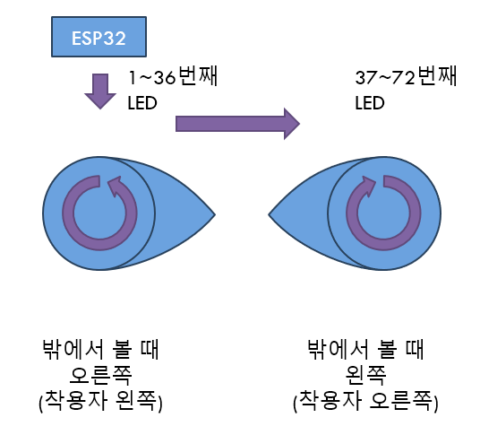

[한국어](hardware.md)
[English](hardware_en_US.md)

# 하드웨어
필수
- ESP32 (권장)
- HUB75 P3 (64x32) 2ea

선택
  - 사이드 패널
    - 네오픽셀 (WS2812B 등)
  - HUD
    - OLED SSD1306 (128x64)
  - 컨트롤러
    - ESP-Now 수신용 ESP32 (RAM 부족으로 추가 보드 필요)
    - IR Remote (저렴하게 구성 가능하지만, 공개 행사용으로 권장되지 않음)

> 주의: ESP32-C3, ESP32-S2, ESP32-S3 등의 보드는 일반 ESP32와 다릅니다. 구입시 주의해주세요!

일반 ESP32를 권장하는 이유입니다.
1. 저렴하고 구하기 쉬우며 보드 종류가 다양합니다.
1. 다른 ESP32 대비 프로그램 업로드와 디버깅이 편리합니다.
1. 듀얼 코어를 활용하여 HUD를 사용해도 60FPS가 유지됩니다.

가장 저렴한 4MB Flash 보드로도 구동 가능하도록 만들어졌으며, 더 많은 표정이나 이미지 탑재를 위해 16MB Flash 모델을 사용하셔도 됩니다.

# ESP32 핀맵
I2C를 제외한 핀맵은 변경 가능합니다. 사용 가능한 핀은 [여기](https://randomnerdtutorials.com/esp32-pinout-reference-gpios/)를 참고해주세요.

## HUB75
| HUB75 | ESP32 | Desc. |
| - | - | - |
| 1 | 25 | R1 |
| 2 | 26 | G1 |
| 3 | 27 | B1 |
| 4 | GND | GND |
| 5 | 14 | R2 |
| 6 | 12 | G2 |
| 7 | 13 | B2 |
| 8 | 32 | E |
| 9 | 23 | A |
| 10 | 19 | B |
| 11 | 5 | C |
| 12 | 33 | D |
| 13 | 18 | CLK |
| 14 | 4 | LATCH |
| 15 | 15 | OE |
| 16 | GND | GND |

## NeoPixel
| ESP32 | Desc. |
| - | - |
| 17 | DI/DO |

## I2C
| ESP32 | Desc. |
| - | - |
| 21 | SDA |
| 22 | SCL |

## 기타
| ESP32 | Desc. |
| - | - |
| 34 | CDS |
| 35 | IR Receiver |

# 사이드 패널
WS2812B 등 NeoPixel을 사용하는 어떤 형태든 가능합니다. 이 부분에는 정답이 없으므로 참고만 해 주세요.

저는 WS2812B LED 스트립을 이용해 만들었으며, 미터당 60개의 LED가 달린 제품을 사용했습니다.

멀티컬러 3D 프린팅을 이용해서 만들었으며 도면은 아래 링크를 참고해주세요.

(업로드 예정)

# 컨트롤러
표정을 한 가지만 사용하고 전혀 바꾸지 않는다면 필요하지 않습니다. 그러나 표정을 바꾸기 위해서는 반드시 필요한데, 프로토젠은 우리의 신경과 연결되어 있지 않기 때문입니다.

## IR 리모컨
전통적으로 많이 쓰인, 단순하고 신뢰성이 높은 방식입니다.

* 장점
  - 직관적이고 단순함
  - 저렴함 (리모컨 + 센서를 2024년 기준 $1 이내로 구성 가능)
  - 저전력 (코인 전지 하나로 몇 개월씩 사용 가능)

* 단점
  - 센서에 조준해야 되므로 자연스러운 액팅은 불가능
  - 비교적 낮은 보안 (다른 프로토젠에게 영향을 주거나 해킹/트롤에 취약)

## ESP-Now 리모컨
ESP-Now는 ESP 보드에서 사용 가능한 Wi-Fi 기반의 Connectionless 통신입니다. 대기 모드부터 시작하면, Wi-Fi는 연결 되기까지 많은 시간도 필요하므로 반응 속도도 떨어지고 전력 소모도 많습니다. 그러나 이 방법을 이용해 연결 없이 통신을 하게 되면, 최대 250 bytes의 적은 데이터만 보낼 수 있지만 반응 속도도 빨라지고, 자연스럽게 전력 소모도 줄어듭니다.

마침 메인보드로 ESP32를 사용중이므로 같이 사용 할 수 있으면 좋았겠지만, 아쉽게도 RAM 부족으로 동시 구동은 어렵습니다. 다른 ESP 보드와 I2C 연결을 통해 사용하도록 구성하는 것을 권장드립니다.

* 장점
  - 센서에 조준할 필요가 없으므로 자연스러운 액팅 가능
  - 비교적 높은 보안

* 단점
  - 제품화된 리모컨 없음
  - IR 대비 비교적 고전력
  - 비교적 비싼 가격
