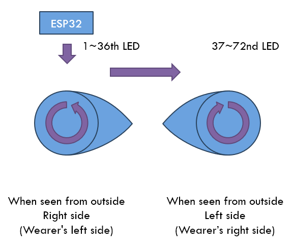

[한국어](hardware.md)
[English](hardware_en_US.md)

# Hardware
Requirements
- ESP32 (recommended)
- HUB75 P3 (64x32) 2ea

Optional
  - Side panel
    - NeoPixel (WS2812B, etc.)
  - HUD
    - OLED SSD1306 (128x64)
  - Controller
    - ESP32 for ESP-Now reception (additional board required due to lack of RAM)
    - IR Remote (inexpensive method, but not recommended for public events)

> Note: Boards such as ESP32-C3, ESP32-S2, ESP32-S3 are different from regular ESP32. Please be careful when purchasing!

This is why we recommend a regular ESP32.
1. It is cheap, easy to obtain, and has a variety of boards.
1. Compared to other ESP32s, program uploading and debugging are convenient.
1. There is no frame drop at 60FPS even when using the HUD using dual cores.

It is designed to run with even the cheapest 4MB Flash board, and you can also use the 16MB Flash model to load more emotions or images.


# ESP32 Pinout
Pin maps except for I2C can be changed. Please see [here](https://randomnerdtutorials.com/esp32-pinout-reference-gpios/) for available pins.

## HUB75
| HUB75 | ESP32 | Desc. |
| - | - | - |
| 1 | 25 | R1 |
| 2 | 26 | G1 |
| 3 | 27 | B1 |
| 4 | GND | GND |
| 5 | 14 | R2 |
| 6 | 12 | G2 |
| 7 | 13 | B2 |
| 8 | 32 | E |
| 9 | 23 | A |
| 10 | 19 | B |
| 11 | 5 | C |
| 12 | 33 | D |
| 13 | 18 | CLK |
| 14 | 4 | LATCH |
| 15 | 15 | OE |
| 16 | GND | GND |


## NeoPixel
| ESP32 | Desc. |
| - | - |
| 17 | DI/DO |


## I2C
| ESP32 | Desc. |
| - | - |
| 21 | SDA |
| 22 | SCL |


## Misc.
| ESP32 | Desc. |
| - | - |
| 34 | CDS |
| 35 | IR Receiver |


# Side panel
Any type that uses NeoPixel, such as WS2812B, is available. There is no perfect way to this part, so please just use it as a reference.

I made this using WS2812B LED strips, with 144 LEDs per meter.



It was made using multi-color 3D printing. Please refer to the link below for the drawing.

<https://www.printables.com/model/803669-side-panel-for-cm1-protogen>


# I2C
We used a lot of pins to drive HUB75, so we don't have enough GPIO. Therefore, most expansions use the I2C bus.

You can set the speed of the I2C bus. The unit is Hz and can be set from 1 to 1,000,000 (1MHz). The default is 100000 (100kHz).

```
  i2c:
    frequency: 100000
```

If you increase the speed, communication may fail due to noise. Noise can be reduced by shortening the length of the cables, air gap, or twisting and shielding the cables. Please see [here](https://docs.slimevr.dev/diy/tracker-schematics.html#cable-layout-recommendation-for-auxiliary-tracker) for more informations.


# Controller
If you only use one emotion and don't change it at all, it's not necessary. However, it is necessary to change emotions, as protogens are not connected to our nerves.


## IR remote
It is a simple and highly reliable method that has been traditionally used.

* Pros
  - Intuitive and simple
  - Inexpensive (remote control + sensor can be configured for less than $1 as of 2024)
  - Low power consumption (can be used for several months on a single coin battery)

* Cons
  - Smooth acting is impossible because you have to aim at the sensor.
  - Relatively low security (vulnerable to influencing other protogens or being hacked/trolled)


## ESP-Now remote
ESP-Now is a Wi-Fi-based connectionless communication available on the ESP board. Starting from standby mode, Wi-Fi takes a long time to connect, which slows down response and consumes a lot of power. However, if it communicate without a connection using this method, only a small amount of data, up to 250 bytes, can be sent, but the response speed is faster and power consumption is inevitably reduced.

Since I'm currently using an ESP32 as my motherboard, it would have been nice to be able to use it together, but unfortunately, simultaneous operation is difficult due to lack of RAM. I recommend configuring it to be used through I2C connection with another ESP board.

* Pros
  - Smooth acting is possible because there is no need to aim at the sensor.
  - Relatively high security

* Cons
  - No commercialized remote control
  - Relatively high power compared to IR
  - Relatively expensive price

It is connected via I2C, just connect SCL and SDA.


# Boop sensor
This is a sensor for detecting boop. When an object, such as your own or someone else's hand, is detected in front of nose (visor), it is possible to change emotion.

I tested the VL53L0X sensor, but it had issues with not penetrating through PETG visors and was unusable. On the other hand, the `VL53L1X` sensor has a slight problem, but it was possible to use it.


## VL53L1X
This is a laser ToF sensor that can measure up to 4m distance and up to 50Hz cycle. It is the only sensor currently supported by ToasterFirmware, and due to other I2C device processing, it can measure up to a 30Hz cycle.


# Light sensor
**Decreasing the brightness may cause flickering, so it is recommended to set the brightness to maximum.**

This is a sensor for automatic brightness adjustment. Currently only 2 types are supported.


## BH1750
This is a digital light sensor that supports light intensity measurement in LUX units. It is connected via I2C, just connect SCL and SDA.


## CDS
You can use a module type such as `KY-018` (not tested), or the circuit is simple, you can make it yourself using CDS and a 1k resistor.
